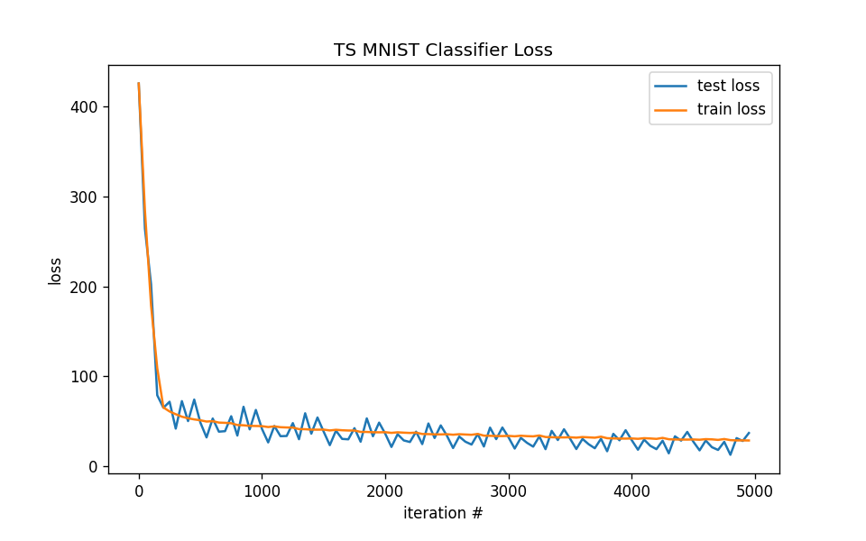
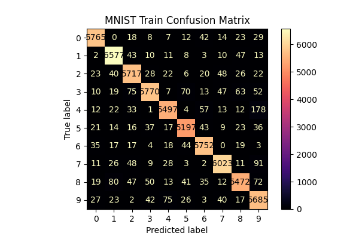
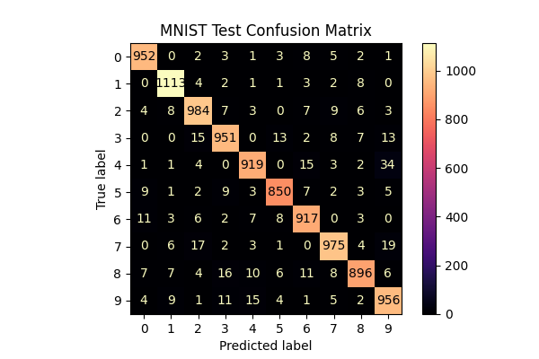

# Tensorslow


Have you ever wanted to to use the power of neural network modeling with absolutely **NONE** of the rush given by competing neural network frameworks? Well if you answered yes to the previous question then Tensorslow is the machine learning framework to use. Using state of the art [**Python3**](https://www.python.org/doc/humor/#the-zen-of-python) lists rather than any complicated and vectorized backends from languages of yester-year like  [C++](https://en.wikipedia.org/wiki/C%2B%2B), we seek to use the Zen of Python to make your machine learning models learn at a pace more compatible with that of your three remaining brain-cells (or at least mine). So, get ready to sit back, take a sip of that green-tea, and enjoy the magic of machine learning with absolutely **NONE** of the stress provided by a machine that works way too quickly for its own good.

# Install
First download the code from the repository
```shell
git clone git@github.com:oortega20/tensorslow.git
```

To install the current release of Tensorslow
```shell
python -m pip install -e tensorslow
```

# Try some simple Tensorslow Programs
Some fun matrix manipulations with tensorslow's linear-algebra package 
```python
>>> from tensorslow.linalg import Tensor
>>> x = Tensor(list(range(6)), (2,3))
>>> x
Tensor([[0.000 1.000 2.000]
        [3.000 4.000 5.000]])
>>> x @ x.T
Tensor([[5.000 14.000]
        [14.000 50.000]])
>>> x.T @ x
Tensor([[9.000 12.000 15.000]
        [12.000 17.000 22.000]
        [15.000 22.000 29.000]])
>>> x - 3
Tensor([[-3.000 -2.000 -1.000]
        [0.000 1.000 2.000]])
>>> 0 * x
Tensor([[0.000 0.000 0.000]
        [0.000 0.000 0.000]])
```
A simple demonstration of forward propagation with Tensorslow's available layers and activations

```python
>>> from tensorslow.linalg import Tensor
>>> from tensorslow.activations import Relu
>>> from tensorslow.layers import Dense
>>>
>>> x = Tensor(list(range(6)), (2,3))
>>> x
Tensor([[0.000 1.000 2.000]
        [3.000 4.000 5.000]])
>>> act = Sigmoid()
>>> f = Dense('f', in_dim=3, out_dim=3)
>>> f.weights['w']
Tensor([[0.057 0.051 0.021]
        [0.047 -0.031 0.003]
        [0.015 -0.052 0.058]])
>>> f.weights['b']
Tensor([0.333 0.333 0.333])
>>> out = act(f(x))
>>> out
Tensor([[0.601 0.549 0.611]
        [0.682 0.525 0.667]])
>>>
```
# Tensorslow MNIST Classifier


### Saved Model Usage
```python
from tensorslow.datasets import MNIST
from tensorslow.models import ts_mnist_classifier

model = ts_mnist_classifier(from_ts=True)
data = MNIST(load_train=False, load_test=True, batch_size=128)
x_test, y_test = data.get_test_data()
for x, y in zip(x_test, y_test):
    probs = model.forward(x) # if we only want the class probabilities
    loss, grad = model.forward(x, y) # if we want to compute losses and gradients
```

### Architecture

Our model is a two layer dense network with relu-activations. Here is the summary of the architecture below.
| name    | weight names   | weight shapes        |   #parameters |
|---------|----------------|----------------------|---------------|
| MODEL   |                |                      |         79510 |
| x_1     | ('w', 'b')     | ((784, 100), (100,)) |         78500 |
| Relu    | (None,)        | (None,)              |             0 |
| x_2     | ('w', 'b')     | ((100, 10), (10,))   |          1010 |
| Softmax | (None,)        | (None,)              |             0 |
### Experimental Setup

In training the tensorslow model for classification on the MNIST Dataset, the default hyper-parameters as as follows: the training-steps is 4,680 with batch-size 128. We trained our model using SGD as the optimization methodology with learning-rate $\lambda=5e-4$ (chosen via some fiddling/trial and error). 



### Results
Our initial training setup has proved to be successful with a final accuracy of **95%** on the test dataset for MNIST. Our model is best able to recognize the digit 1 and is least able to recognizing the digit 8. We have detailed summaries of our results in the graphs below.

**Train Accuracy**
| DIGIT   |   ACC RATE (%) |
|---------|----------------|
| 0       |          0.974 |
| 1       |          0.978 |
| 2       |          0.961 |
| 3       |          0.942 |
| 4       |          0.943 |
| 5       |          0.96  |
| 6       |          0.973 |
| 7       |          0.964 |
| 8       |          0.937 |
| 9       |          0.957 |
| TOTAL   |          0.957 |


**Test Accuracy**

| DIGIT   |   ACC RATE (%) |
|---------|----------------|
| 0       |          0.974 |
| 1       |          0.981 |
| 2       |          0.954 |
| 3       |          0.942 |
| 4       |          0.939 |
| 5       |          0.954 |
| 6       |          0.958 |
| 7       |          0.949 |
| 8       |          0.923 |
| 9       |          0.948 |
| TOTAL   |          0.95  |


## Future Work
We plan to implement and perform experiments using the various activation functions mentioned in [[1]](https://doi.org/10.20944/preprints202301.0463.v1.) for use within tensorslow. Be on the lookout for results of experiments within our tensorslow experimentation repository [here](https://github.com/oortega20/tensorslow-experimentation). We also plan to perform experiments with the optimizers included within the tensorslow framework.


[1] Pishchik, E. Trainable Activations for Image Classification. Preprints 2023, 2023010463. https://doi.org/10.20944/preprints202301.0463.v1.
